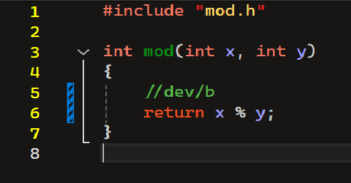
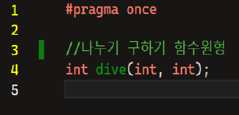
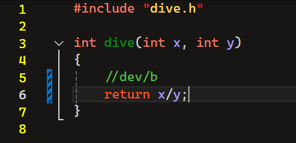

## calc
## oss 기말 프로젝트
저장소 : https://github.com/rkdckdfhr/ossFinalPrc

 
팀원:
강창록
정진관
박성현
장주혁

<h2>문제해결 방법과 순서</h2>

1. mul 수정

.png)

2. mod 수정

3. dive.h 수정

4. dive.cpp 수정

5. calc.cpp 수정

.png)

6. git flow

